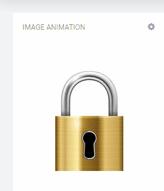

# Cumulocity IoT Image Animation widget

## Features
**Scroll Left:** Animate an image such as a gate to scroll left

**Scroll Right:** Animate an image such as a gate to scroll right

**Scroll Up:** Animate an image such as a garage door to scroll upwards 

**Scroll Down:** Animate an image to scroll down

**Fade In:** Fade a hidden image into view

**Fade Out:** Fade an image out of view

**Rotate:** Rotate an image 

**Swap:** Swap one image with another image

## Installation

### Runtime Widget Deployment?

* This widget supports runtime deployment. Download the [Runtime Binary](https://github.com/SoftwareAG/cumulocity-image-animation-widget/releases/download/v1.0.4/image-animation-widget-1.0.4.zip) and use application builder to install your runtime widget.

## Userguide
This guide will teach you how to add the widget in your existing or new dashboard.

NOTE: This guide assumes that you have followed the [installation](https://github.com/SoftwareAG/cumulocity-runtime-widget-loader) instructions

1. Open the Application Builder application from the app switcher (Next to your username in the top right)
2. Add a new dashboard or navigate to an existing dashboard
3. Click `Add Widget`
4. Search for `Image Animation`
5. See below for the configuration options

### Configuration options

The widget configuration page contains a number of configuration attributes. These attributes are dependent upon the '**Animation type**' which is selected.

 - **Target Assets or Devices** : Select your device
     
 - 	**Animation type**: `Scroll up`, `Scroll down`, `Scroll left`, `Scroll right`

	- **Image file**
Select the image file which you want to use in the widget. The file type must be either a .png, .jpeg or .jpg.

	- **Event type to animate off to on**
Enter the event type which will animate the image from the scroll start to the scroll end position e.g. OpenGate

	- **Short description when animating off to on**
Enter the description that should be displayed when the animation moves from scroll start to the scroll end position e.g 'Opened the gate'

	- **Event type to animate on to off**
Enter the event type which will animate the image from the scroll end to the scroll start position e.g. CloseGate

	- **Short description when animating off to on**
Enter the description that should be displayed when the animation moves from scroll end to the scroll start position e.g. 'Closed the gate'
	
	 - **Height** (in pixels)
Enter the height (in pixels) for your image e.g. 300

	- **Width** (in pixels)
Enter the width (in pixels) for your image e.g. 500

	- **Remaining image** (in percentage)
Enter the amount of image (as a percentage) which should remain on the screen. If you want the whole image to completely animate off the screen, set this value to 0

	- **Animation time** (in seconds)
Enter the amount of seconds the animation should take to complete e.g. 2. If you want the image to scroll immediately, set this value to 0

	- **Location of the short description**
Select the location where the short description should be displayed from the dropdown

 - **Animation type**: ``Fade in``, `Fade out`

	- **Image file**
Select the image file which you want to use in the widget. The file type must be either a .png, .jpeg or .jpg.
	
	- **Event type to animate off to on**
Enter the event type which will animate the image from the fade start to the fade end position e.g. 'ShowImage'

	- **Short description when animating off to on**
Enter the description that should be displayed when the animation moves from fade start to the fade end position e.g. 'Showing Image'

	- **Event type to animate on to off**
Enter the event type which will animate the image from the fade end to the fade start position e.g. 'HideImage'

	- **Short description when animating off to on**
Enter the description that should be displayed when the animation moves from fade end to the fade start position e.g. 'Hiding image'
	
	- **Height** (in pixels)
Enter the height (in pixels) for your image e.g. 300

	- **Width** (in pixels)
Enter the width (in pixels) for your image e.g. 500

	- **Remaining image** (in percentage)
Enter the amount of image (as a percentage) which should remain on the screen. If you want the whole image to completely fade in or out, set this value to 0

	- **Animation time** (in seconds)
Enter the amount of seconds the animation should take to complete e.g. 2. If you want the image to fade immediately, set this value to 0

	- **Location of the short description**
Select the location where the short description should be displayed from the dropdown

- **Animation type**: ``Rotate``

	- **Image file**
	Select the image file which you want to use in the widget. The file type must be either a .png, .jpeg or .jpg.

	- **Event type to animate off to on**
Enter the event type which will animate the image from the rotate start to the  rotate end position e.g. StartWatering

	- **Short description when animating off to on**
Enter the description that should be displayed when the animation moves from rotate start to the rotate end position e.g. 'Started watering'

	- **Event type to animate on to off**
Enter the event type which will animate the image from the rotate end to the rotate start position e.g. 'StopWatering'

	- **Short description when animating off to on**
Enter the description that should be displayed when the animation moves from rotate end to the rotate start position e.g. 'Stopped watering'
		
	- **Height** (in pixels)
Enter the height (in pixels) for your image e.g. 300

	- **Width** (in pixels)
Enter the width (in pixels) for your image e.g. 500

	- **Rotation** (in degrees)
Enter the amount of degrees the image should rotate. The valid range is -360 to 360. 
To tip the image, like a watering can, enter 60. To invert the image backwards, enter -180

	- **Animation time** (in seconds)
Enter the amount of seconds the animation should take to complete e.g. 2. If you want the image to rotate immediately, set this value to 0

	- **Location of the short description**
Select the location where the short description should be displayed from the dropdown

- **Animation type**: `Swap`

	- **From image file**
	Select the image file which you want to animate from. The file type must be either a .png, .jpeg or .jpg.

	- **To image file**
	Select the image file which you want to animate to. The file type must be either a .png, .jpeg or .jpg.

	- **Event type to animate off to on**
Enter the event type which will animate the image from the the first image to the second image e.g. 'LockPadlock'

	- **Short description when animating off to on**
Enter the description that should be displayed when the animation moves from first image to the second image 'Padlock is locked'

	- **Event type to animate on to off**
Enter the event type which will animate the image from the second image to the first image e.g. 'UnlockPadlock'

	- **Short description when animating off to on**
Enter the description that should be displayed when the animation moves from the second image back to the first image e.g. 'Padlock is unlocked'
		
	- **Height** (in pixels)
Enter the height (in pixels) for your images e.g. 300

	- **Width** (in pixels)
Enter the width (in pixels) for your images e.g. 500

	- **Animation time** (in seconds)
Enter the amount of seconds the animation should take to complete e.g. 2. If you want the image to swap immediately, set this value to 0

	- **Location of the short description**
Select the location where the short description should be displayed from the dropdown

### Animating the widget using Cumulocity events

To control the widget, you will need to POST an authenticated Cumulocity event to your tenant. 

- **Animating from the start position to the end position**

    https://\<**your cumulocity tenant url**\>/event/events

    In the 'body' of your POST Cumulocity event, you will need to include the following: 
	
	
	    {  
	      source: The body should include the targeted device Id 
    
	      type: "<This will be your animationActionOn value>"
    
	      text: ""
    
	      time: [the current datetime]
	    }

   e.g. 

	    {
	        "source": { "id": "31435268" },
	        "type":"StartWatering",
	        "text": "",
	        "time": "2020-10-29T09:16:25.598+02:00"
	    }

- **Animating from the end position to the start position**

    https://\<**your cumulocity tenant url**\>/event/events
    
    In the 'body' of your POST Cumulocity event, you will need to include the following: 

	    {
	      source: The body should include the targeted device Id 
	    
	      type: "<This will be your animationActionOff value>"
      
	      text: ""
      
	      time: [the current datetime]
	    }

   e.g. 

	    {
	        "source": { "id": "31435268" },
	        "type":"StopWatering",
	        "text": "",
	        "time": "2020-10-29T09:16:26.598+02:00"
	    }

### Resetting the animation
At any time a 'AnimationActionReset' Cumulocity event can be sent which will immediately position the image back to the original start position.

To reset the image, POST an authenticated Cumulocity event to your tenant.

In the 'body' of your Cumulocity event, you will need to include the following: 

https://\<**your cumulocity tenant url**\>/event/events

	    {  
	       source: The body should include the targeted device Id 
     
	       type: "AnimationActionReset"
     
	       text: ""
          
	       time: [the current datetime]
	    }

e.g. 

	    {
	        "source": { "id": "31435268" },
	        "type":"AnimationActionReset",
	        "text": "",
	        "time": "2020-10-29T09:27:25.598+02:00"
	    }

When the 'AnimationAction' (text = '') Cumulocity event is posted to your tenant, this will cause the image to be set back to the original position without any animation.

## Advanced: Configuring the widget in real-time using Cumulocity events

All attributes for this widget can be amended in real-time.

To configure the widget, POST an authenticated Cumulocity event to your tenant

In the 'body' of your Cumulocity event, you will need to include the following:
(Note : in the text attribute, you do not need to include all the attributes)

https://\<**your cumulocity tenant url**\>/event/events

    {
      source: The body should include the targeted device Id 
      
      type: "AnimationConfiguration"
      
      text: {
      
        imageText: The base64 encoded image file string ( you can generate this using https://www.base64-image.de/ and copy / pasting the image using the 'copy image' button on the website)

        imageText2: The base64 encoded 'To Image' file string ( you can generate this using https://www.base64-image.de/ and copy / pasting the image using the 'copy image' button on the website). Note that this attribute is only required for the 'SWAP' Animation action.
                
        height: the height of your image (in pixels)

        width: the width of your image (in pixels)

	    animationActionOn: The event type to move the animation from the start position to the end position

	    animationActionOff: The event type to move the animation from the end position to the start position

	    shortDescriptionOffToOn: The description shown when animating from the start position to the end position

	    shortDescriptionOnToOff: The description shown when animating from the end position to the start position
		
	    shortDescriptionLocation: 'ABOVE', 'BELOW'

        animationTimeInSeconds: The amount of time taken to complete the animation.

        remainingImagePercentage: The amount of the image that should remain visible once it has been scrolled out of view

        rotationInDegress: The amount of the degrees an image should rotate. Note that this attribute is only required for the 'ROTATE' Animation action.

        AnimationAction: "SCROLL UP", "SCROLL DOWN", "SCROLL LEFT", "SCROLL RIGHT", "FADE OUT", "FADE IN", "ROTATE", "SWAP"
      }
        
      "time": "2020-10-29T09:16:30.598+02:00"
    }

**IMPORTANT**: in the text attribute, you will need to escape the double quotes with '\' characters to ensure that it is read in as stringified JSON. *This is shown in the example below.*

**TIP** : Use a website like [https://www.base64-image.de/](https://www.base64-image.de/) to encode your image files into base64 strings.

e.g.

https://<**your cumulocity tenant url**\>/event/events

POST:

    {
        "source": { "id": "32536261" },
        "type": "AnimationConfiguration",
        "text": "{\"imageFile\":\"data:image/jpeg;base64,/9j/4AAQSkZJRg...\",\"height\":300,\"width\":500,\"remainingImagePercentage\":5,\"animationTimeInSeconds\":5,\"animationAction\":\"SCROLL LEFT\",\"animationActionOn\":\"Open\",\"animationActionOff\":\"Close\",\"shortDescriptionOffToOn\":\"Opened\","\"shortDescriptionOnToOff\":\"Closed\",\"shortDescriptionLocation\":\"BELOW\"}",
        "time": "2020-10-29T09:28:38.598+02:00"
    }

As detailed above, the text attribute does not need to include all the configuration information. For example, to only change the animationAction and animationTimeInSeconds, you can send in those specific updates.

e.g.

https://<**your cumulocity tenant url**\>/event/events

POST:

    {
        "source": { "id": "32536261" },
        "type": "AnimationConfiguration",
        "text": "{\"AnimationAction\":\"SCROLL UP\",\"animationTimeInSeconds\":10}",
        "time": "2020-10-29T10:02:22.598+02:00"
    }

*  When the 'AnimationConfiguration' Cumulocity event is posted to your tenant, this will immediately update the configuration for your image. 

*  When the 'AnimationAction' Cumulocity event is posted to your tenant, this will cause the image to scroll using your updated attributes.

### AnimationAction & Real-time configuration samples
A **Postman** collection of AnimationAction and realtime configuration samples has been included in the /configuration-samples folder. Please import this into your[https://www.postman.com/](https://www.postman.com/) account

1. Ensure that the Image Animation Widget has been installed into your tenant and added to your dashboard
2. Amend the Basic Auth to include your username and password
3. Replace '<**your cumulocity tenant url**\>' in the url to your tenant url

### Development - to enhance and test this widget in your local environment
1. Clone the repository on your local machine using `git clone https://github.com/SoftwareAG/cumulocity-image-animation-widget.git`.
2. Run `npm install` to download the module dependencies.
3. Run `c8ycli server -u https://your_tenant_url` to start the server.
4. Go to `http://localhost:9000/apps/cockpit/` in the browser to view and test your changes.
5. (Optional) push the changes back to this repository.

### Build - to create a new build of the image-animation widget for the Runtime Widget Loader
1. Finish the development and testing on your local machine.
2. Run `gulp` to start the build process.
3. Use the `image-animation-widget.zip` file in the `dist` folder as your distribution file.

------------------------------

This widget is provided as-is and without warranty or support. They do not constitute part of the Software AG product suite. Users are free to use, fork and modify them, subject to the license agreement. While Software AG welcomes contributions, we cannot guarantee to include every contribution in the master project.
_____________________
For more information you can Ask a Question in the [TECHcommunity Forums](https://tech.forums.softwareag.com/tags/c/forum/1/Cumulocity-IoT).

You can find additional information in the [Software AG TECHcommunity](https://tech.forums.softwareag.com/tag/Cumulocity-IoT).

